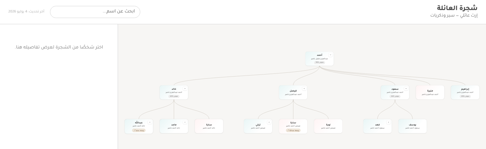

# شجرة العائلة

موقع تفاعلي لعرض شجرة عائلة كاملة مع السير الذاتية لأفرادها، مبني بالكامل بالعربية واتجاه RTL.

> **ملاحظة**: هذا مشروع عرض (portfolio) مبني على نسخة معدَّلة من مشروع شخصي حقيقي، استُبدلت فيه كل الأسماء والبيانات ببيانات وهمية بالكامل (عائلة افتراضية) للحفاظ على خصوصية العائلة الأصلية، مع الإبقاء على جميع الميزات والبنية التقنية كما هي.

🔗 **تجربة حية**: `https://<username>.github.io/family-tree/` _(حدّث الرابط بعد النشر)_



## الميزات

- **شجرة تفاعلية** قابلة للتكبير والتصغير والتحريك (بناءً على `d3-hierarchy` و`d3-zoom`)، تعرض عدة أجيال في آن واحد.
- **لوحة تفاصيل** لكل شخص: نبذة، إنجازات، قصص وذكريات قابلة للطي، وصورة شخصية عند توفرها.
- **بحث عربي ذكي** يتجاوز اختلافات الكتابة الشائعة (مثل "عبدالله" مقابل "عبد الله").
- **دعم تعدد الزوجات**، مع تمييز الأم/الأب الفعلي للأبناء عند اللزوم (`motherId`/`fatherId`).
- **رصد زواج الأقارب** تلقائيًا: إن كان الزوجان من نفس الشجرة تظهر "شارة رابطة" بدل تكرار البطاقة.
- **بيانات كمصدر وحيد للحقيقة**: كل الشجرة تُبنى من ملف JSON واحد ([`data/people.json`](data/people.json))، بلا قاعدة بيانات.
- **تحقق آلي من سلامة البيانات** (معرّفات مكررة، مراجع مفقودة، حلقات في الأنساب) يعمل محليًا وضمن CI.
- **اختبارات وحدة** (Vitest) لمنطق بناء الشجرة ورصد زواج الأقارب.
- **نشر تلقائي على GitHub Pages** عند كل push إلى main، بعد تحقق من البيانات واختبارات وlint.

## التقنيات

React + TypeScript + Vite، مع `d3-hierarchy`/`d3-shape`/`d3-zoom` لحساب تخطيط الشجرة والتفاعل معها، وخط Tajawal عبر `@fontsource`.

## التشغيل محليًا

```bash
npm install
npm run dev
```

## كيف تضيف شخصًا جديدًا؟

كل البيانات في ملف واحد: [`data/people.json`](data/people.json). أضف كائنًا جديدًا لكل شخص ضمن مصفوفة `people`:

```json
{
  "id": "معرّف-فريد-بالإنجليزية",
  "gender": "male",
  "firstName": "الاسم الأول",
  "fatherName": "اسم الأب",
  "grandfatherName": "اسم الجد",
  "birthYear": 1970,
  "deathYear": null,
  "alive": true,
  "bio": "نبذة عن الشخص.",
  "achievements": ["إنجاز أول", "إنجاز ثانٍ"],
  "children": [],
  "spouses": []
}
```

نقاط مهمة لتسهيل الربط التلقائي بين الأشخاص:

- **لا تكتب حقل `parents` يدويًا** — يُشتق تلقائيًا من حقل `children` عند والد الشخص. يكفي أن تضيف معرّف الابن الجديد إلى مصفوفة `children` عند أبيه.
- **الأبناء يُسجَّلون تحت الأب** (وليس الأم) كقاعدة ثابتة، حتى في حالات زواج الأقارب — هذا يحدد "المكان الأساسي" للشخص في الشجرة.
- **الزوج/الزوجة**: يكفي كتابة `spouses` على أحد الطرفين فقط؛ يُدمج تلقائيًا ليظهر على الطرفين.
- **`familyName`** اختياري لكل شخص؛ إن حُذف يُستخدم `meta.familyName` تلقائيًا (مفيد للأزواج/الزوجات القادمين من خارج العائلة).
- **زواج الأقارب**: إن كان الزوج/الزوجة موجودًا أصلاً في الشجرة (كابن عم مثلاً)، اكتب معرّفه في `spouses` كالمعتاد — الموقع سيتعرف تلقائيًا أنه ليس زواجًا من خارج العائلة ويعرض "شارة رابطة" بدل تكرار بطاقته.
- **`stories`** حقل اختياري لإضافة قصص وذكريات عن الشخص، تظهر كقائمة قابلة للطي في لوحة التفاصيل:

  ```json
  "stories": [
    { "title": "عنوان القصة", "narrator": "اسم الراوي", "text": "نص القصة." }
  ]
  ```

### تاريخ آخر تحديث

حقل `meta.lastUpdated` (بصيغة `"YYYY-MM-DD"`) يظهر كملاحظة صغيرة في أعلى يسار الموقع. حدّثه يدويًا عند كل تعديل على البيانات.

### التحقق من صحة البيانات

بعد أي تعديل، شغّل:

```bash
npm run validate
```

يتحقق هذا الأمر من عدم تكرار المعرّفات، ووجود كل المعرّفات المُشار إليها، وخلو `children` من الحلقات، ويطبع تحذيرات (مثل متوفى بدون سنة وفاة) دون إيقاف العملية. هذا الفحص يعمل تلقائيًا أيضًا قبل كل نشر عبر GitHub Actions.

### الاختبارات

```bash
npm run test
```

اختبارات وحدة (Vitest) لمنطق بناء الشجرة في [`src/utils/buildGraph.test.ts`](src/utils/buildGraph.test.ts): اشتقاق `parents`، دمج `spouses` على الطرفين، القيمة الافتراضية لـ`familyName`، ورصد زواج الأقارب. تعمل تلقائيًا أيضًا ضمن CI قبل كل نشر.

## النشر

الموقع يُنشر تلقائيًا على GitHub Pages عند كل push إلى main (عبر [.github/workflows/deploy.yml](.github/workflows/deploy.yml)). المطلوب مرة واحدة فقط: من إعدادات المستودع على GitHub → Settings → Pages → Source، اختر **GitHub Actions**.

إن اختلف اسم المستودع عن `family-tree`، حدّث قيمة `base` في [`vite.config.ts`](vite.config.ts) لتطابق اسم المستودع الفعلي.

## أفكار مستقبلية (خارج النطاق الحالي)

- عرض التاريخ الهجري بجانب الميلادي.
- واجهة تحرير رسومية بدل تعديل JSON مباشرة.
- نسخة قابلة للطباعة/التصدير كملف PDF.

## الرخصة

هذا المشروع مرخّص بموجب [MIT License](LICENSE).
